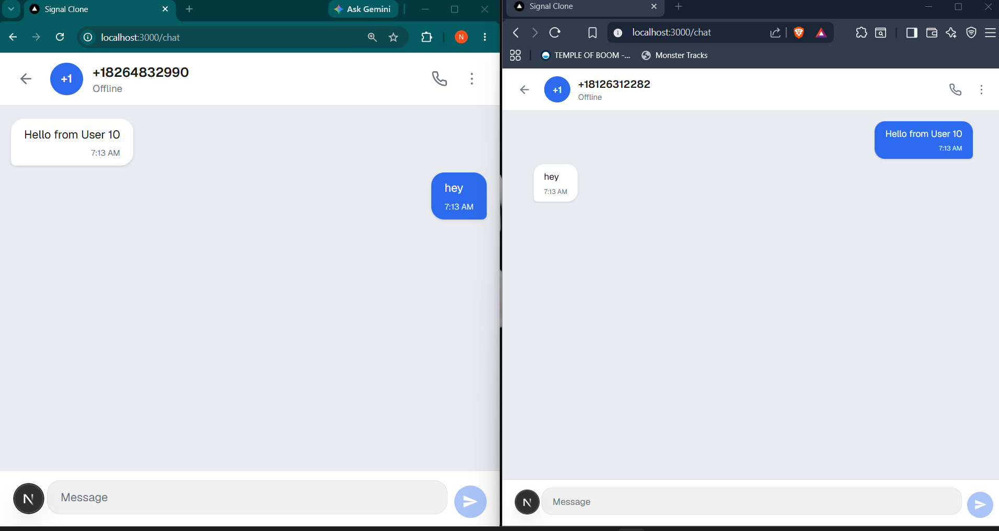
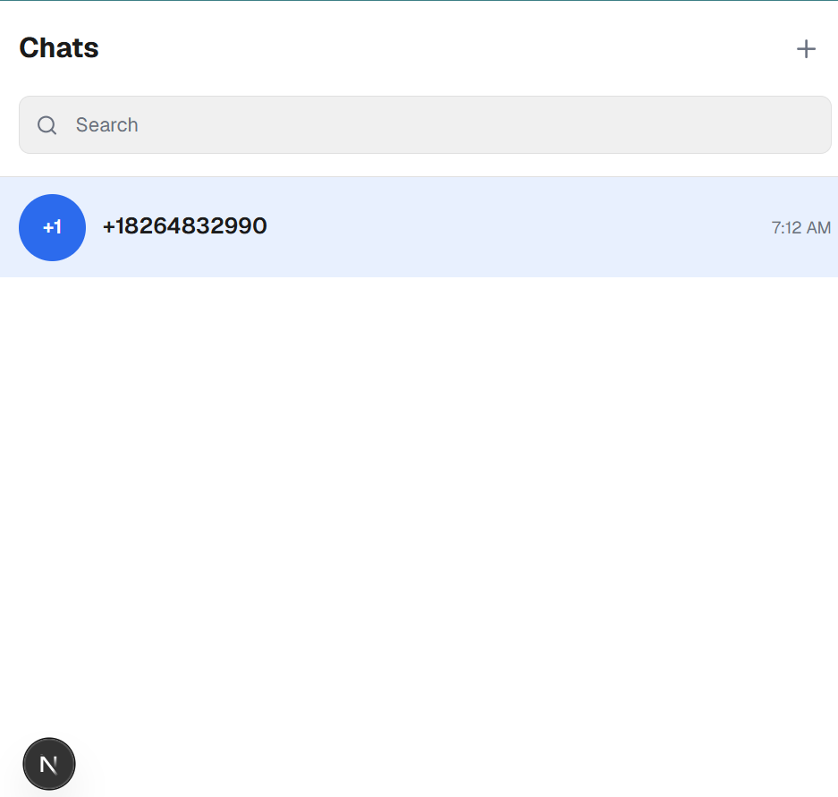

# Secure Messaging Platform (Signal Clone)

A full-stack messaging application inspired by Signal, built using **Next.js**, **FastAPI**, **SQLite**, and **Native WebSockets**.

The application recreates the core messaging experience of Signal, including user authentication, conversation management, and real-time messaging. The project focuses on clean architecture, responsive UI, persistent storage, and real-time communication while keeping authentication and encryption mocked as specified in the assignment.

---

# Live Demo

**Frontend (Vercel)**

https://signal-clone-five.vercel.app

**Backend (Render)**

https://signal-clone-faec.onrender.com

---

# GitHub Repository

https://github.com/Namitjoshii/signal-clone

---

# Screenshots

## Login



## Chat Interface



---

# Features

## Authentication

- Mock phone number registration
- Fixed OTP verification (`123456`)
- User login
- Session persistence using Local Storage
- Mock JWT authentication

---

## Conversations

- View all conversations
- Create new direct conversations
- Recent conversation sidebar
- Automatic conversation updates
- Responsive chat layout

---

## Real-Time Messaging

- Native WebSocket implementation
- Instant message delivery
- Two-way communication
- Persistent message history
- Automatic WebSocket reconnection
- Message timestamps

---

## Database

- SQLite database
- Persistent users
- Persistent conversations
- Persistent messages
- Relational schema using SQLAlchemy ORM

---

# Tech Stack

| Layer | Technology |
|--------|------------|
| Frontend | Next.js 15 |
| Language | TypeScript |
| Styling | Tailwind CSS |
| Backend | FastAPI |
| ORM | SQLAlchemy |
| Database | SQLite |
| Validation | Pydantic |
| Real-Time | Native WebSockets |

---

# Project Structure

```text
signal-clone/

├── backend/
│   ├── app/
│   │   ├── models/
│   │   ├── routers/
│   │   ├── schemas/
│   │   ├── services/
│   │   ├── websocket/
│   │   └── main.py
│   │
│   ├── requirements.txt
│   └── signal.db
│
├── frontend/
│   ├── app/
│   ├── components/
│   ├── hooks/
│   ├── lib/
│   ├── public/
│   └── package.json
│
└── README.md
```

---

# Database Schema

## Users

- id
- username
- phone
- display_name
- avatar
- created_at

---

## Conversations

- id
- type
- name
- created_at

---

## Conversation Members

- id
- conversation_id
- user_id

---

## Messages

- id
- conversation_id
- sender_id
- content
- created_at

---

# REST API

## Authentication

```http
POST /auth/register
POST /auth/login
```

---

## Users

```http
GET /users
```

---

## Conversations

```http
GET /conversations
GET /conversations/{id}
POST /conversations/direct
POST /conversations/group
```

> Group conversation endpoints are available in the backend for future UI integration.

---

## Messages

```http
GET /messages/{conversation_id}
POST /messages
PATCH /messages/{message_id}/read
```

---

# WebSocket

```text
ws://<backend-url>/ws/{conversation_id}/{user_id}
```

Supports

- Real-time messaging
- Automatic reconnection
- Live message updates

---

# Local Setup

## Backend

```bash
cd backend

python -m venv venv

source venv/bin/activate
```

Windows

```bash
venv\Scripts\activate
```

Install dependencies

```bash
pip install -r requirements.txt
```

Run server

```bash
uvicorn app.main:app --reload
```

Backend runs on

```text
http://127.0.0.1:8000
```

---

## Frontend

```bash
cd frontend

npm install

npm run dev
```

Frontend runs on

```text
http://localhost:3000
```

---

## Environment Variables

Create a `.env.local` file inside the frontend directory.

```env
NEXT_PUBLIC_API_URL=http://127.0.0.1:8000
NEXT_PUBLIC_WS_URL=ws://127.0.0.1:8000
```

---

# Mock Authentication

OTP

```text
123456
```

---

# Architecture

```text
                 Next.js Frontend
                        │
                REST API + WebSocket
                        │
                 FastAPI Backend
                        │
                  SQLAlchemy ORM
                        │
                     SQLite
```

---

# Key Highlights

- Signal-inspired user interface
- FastAPI REST APIs
- Native WebSocket communication
- SQLite persistent storage
- Real-time messaging
- Clean modular architecture
- TypeScript frontend
- Responsive layout
- Component-based frontend
- SQLAlchemy ORM

---

# Assumptions

- Authentication is mocked as allowed in the assignment.
- OTP verification uses a fixed OTP (`123456`).
- End-to-end encryption is intentionally mocked.
- Voice/Video calls, Stories, and Linked Devices are not implemented.
- Group conversation backend endpoints are implemented, while complete frontend integration can be extended in future iterations.

---

# Future Improvements

- Typing indicators
- Read receipts
- Emoji reactions
- Media attachments
- Push notifications
- End-to-end encryption
- Voice & Video Calling
- Dark Mode


---

# Author

**Namit Joshi**

GitHub: https://github.com/Namitjoshii